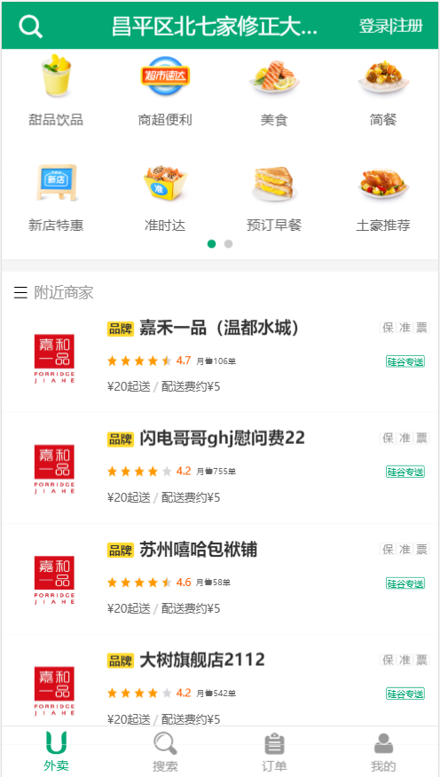
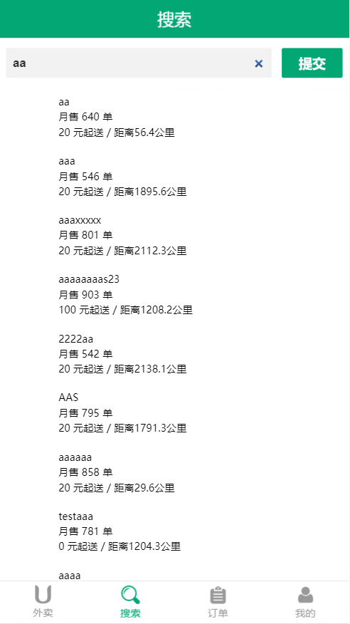
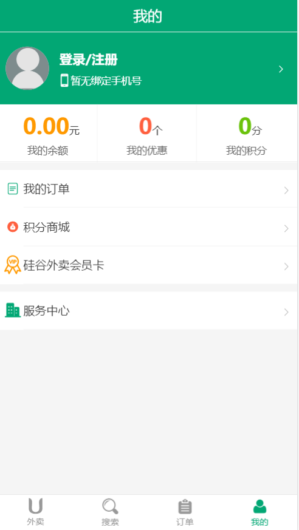
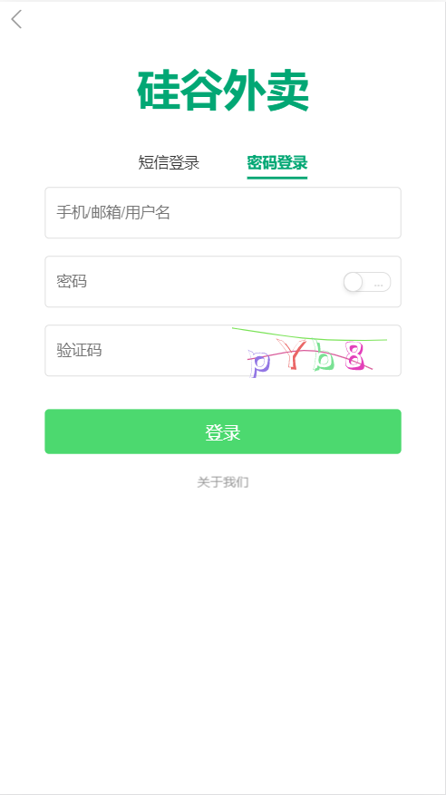

 1.基于 Vue 的最新版本；
 
 2.项目是关于外卖业务的前后台分离Web App，功能模块包含商家, 商品, 购物车, 用户管理等多个模块；
 
 3.后台应用技术架构为: Node + Express + Mongodb + Mongoose；
 
 4.前台应用技术架构为: vue + vuex + vue-router + webpack + ES6；
 
 5.采用模块化、组件化、工程化的模式开发；
 
 6.项目运行说明：
	1) 确保安装了node环境
	2) 确保安装了mongodb, 并启动了对应的服务
    3)启动后台应用,进入shop-serve,执行命令: npm start
    4)启动前台应用并访问,进入shop-client,执行命令: npm start
    
## 项目功能：
## 1. 完成登陆/注册功能
    1). 2种方式
       手机号/短信验证码登陆
       用户名/密码/图片验证码登陆
    2). 登陆的基本流程
       表单前台验证, 如果不通过, 提示
       发送ajax请求, 得到返回的结果
       根据结果的标识(code)来判断登陆请求是否成功
           1: 不成功, 显示提示
           0. 成功, 保存用户信息, 返回到上次路由
    3). vue自定义事件
       绑定监听: @eventName="fn"  function fn (data) {// 处理}
       分发事件: this.$emit('eventName', data)
    4). 注意:
       使用network查看请求(路径/参数/请求方式/响应数据)
       使用vue的chrome插件查看vuex中的state和组件中的数据
       使用debugger语句调试代码
       实参类型与形参类型的匹配问题
       
## 2. 搭建商家整体界面
    1). 拆分界面路由
    2). 路由的定义/配置|使用

## 3. 模拟(mock)数据/接口
    1). 前后台分离的理解
    2). mockjs的理解和使用
    3). jons数据设计的理解
     
## 4. ShopHeader组件
    1). 异步显示数据效果的编码流程
        ajax
          ajax请求函数
          接口请求函数
        vuex
          state
          mutation-types
          actions
          mutations
        组件
          dispatch(): 异步获取后台数据到vuex的state
          mapState(): 从vuex的state中读取对应的数据
          模板中显示
    2). 初始显示异常
        情况1: Cannot read property 'xxx' of undefined"
        原因: 初始值是空对象, 内部没有数据, 而模块中直接显示3层表达式
        解决: 使用v-if指令
        
        情况2: Cannot read property 'xxx' of null"
     
    3). vue transition动画
    
## 5. ShopGoods组件
    1). 动态展现列表数据
    2). 基本滑动:
        使用better-scroll
        理解其基本原理
        创建BScroll对象的时机
          watch + $nextTick()
          callback + $nextTick
    3). 滑动右侧列表, 左侧同步更新
        better-scroll禁用了原生的dom事件, 使用的是自定义事件
        绑定监听: scroll/scrollEnd
        滚动监听的类型: probeType
        列表滑动的3种类型
            手指触摸
            惯性
            编码
        分析:
            类名: current 标识当前分类
            设计一个计算属性: currentIndex
            根据哪些数据计算?
              scrollY: 右侧滑动的Y轴坐标 (滑动过程时实时变化)
              tops: 所有右侧分类li的top组成的数组  (列表第一次显示后就不再变化)
        编码:
            1. 在滑动过程中, 实时收集scrollY
            2. 列表第一次显示后, 收集tops
            3. 实现currentIndex的计算逻辑
    4). 点击左侧列表项, 右侧滑动到对应位置
    
## 6. CartControl组件
    1). 问题: 更新状态数据, 对应的界面不变化
        原因: 一般方法给一个已有绑定的对象中添加一个新的属性, 这个属性没有数据绑定
        解决: 
            Vue.set(obj, 'xxx', value)才有数据绑定
            this.$set(obj, 'xxx', value)才有数据绑定
            
## 7. ShopCart组件
    1). 使用vuex管理购物项数据: cartFoods
    2). 解决几个功能性bug

## 8. Food组件
    1). 父子组件:
        子组件调用父组件的方法: 通过props将方法传递给子组件
        父组件调用子组件的方法: 通过ref找到子组件标签对象

## 9. ShopRatings组件
    1). 列表的过滤显示
    2). 自定义过滤器
    
## 10. ShopInfo组件
    1). 使用better-scroll实现两个方向的滑动
    1). 通过JS动态操作样式
    2). 解决当前路由刷新异常的bug
    
## 11. Search组件
    1). 根据关键字来异步搜索显示匹配的商家列表
    2). 如实实现没有搜索结果的提示显示

## 12. 项目优化
    1). 缓存路由组件对象
    2). 路由组件懒加载
    3). 图片司加载: vue-lazyload
    4). 分析打包文件并优化 
    

### 运行效果
      
                                                  
						  
						  
						  
